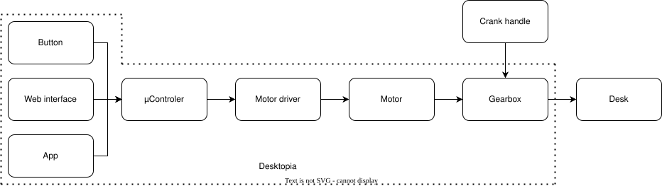

# Desktopia

Desktopia is an open-source project for easy height control of your IKEA Skarsta/Trotten sit-stand desk, providing a comfortable and customizable workspace experience.

# How it works

