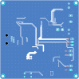
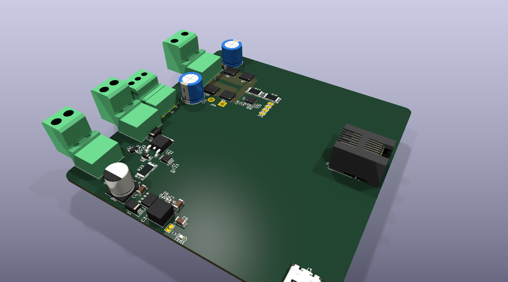
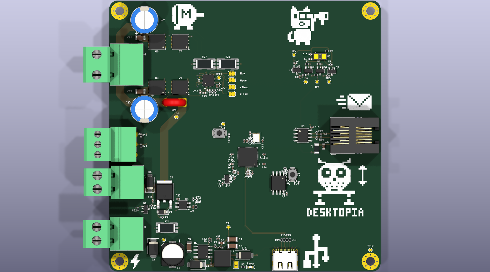
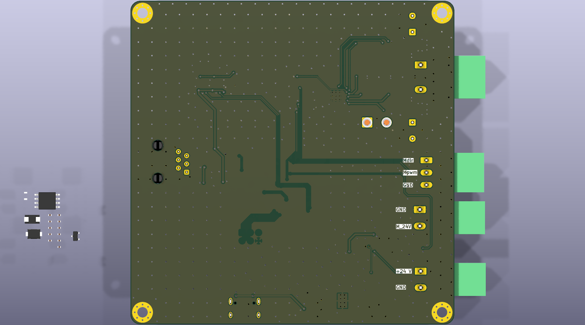

# Desktopia – motherboard

KiCad 10 project: `desktopia.kicad_sch`, `desktopia.kicad_pcb`. Firmware: [../../firmware/desktopia/](../../firmware/desktopia/README.md).

The motherboard sits under the desk top. It takes the 24 V supply and passes it through a current shunt and a MOSFET
switch to its own H-bridge (DRV8701E gate driver, four N-MOSFETs), which drives the motor. The bridge can be bypassed:
J5 / J6 still give the switched 24 V and DIR / PWM to an external driver. The board measures the height, powers the HMI
board and talks to it.

## Views

Interactive viewer (KiCanvas, opens the files of the `main` branch in the browser):
[schematic](https://kicanvas.org/?github=https://github.com/Diabltica/Desktopia/blob/main/hardware/desktopia/desktopia.kicad_sch) · [PCB](https://kicanvas.org/?github=https://github.com/Diabltica/Desktopia/blob/main/hardware/desktopia/desktopia.kicad_pcb).

The images below are rendered by [`../render.sh`](../render.sh) and committed by the
[*Hardware images*](../../.github/workflows/hardware-images.yml) workflow on every push that touches `hardware/`.
Click an image to open it full size.
The 3D view shows the JP6 wire link fitted, and the plugs of J1 / J5 / J6 / J7 in their headers: the
`Desktopia:PluggableHeader_*` footprints carry KiCad's Phoenix Contact header model and a plug generated by
[`pluggable_plug_3d.py`](../kicad_library/pcb/tools/pluggable_plug_3d.py) (the footprints by
[`pluggable_header_fp.py`](../kicad_library/pcb/tools/pluggable_header_fp.py)).

Reading the schematic: connections are drawn as wires. A label only appears where a net leaves one block for another,
at the MCU pin and at the block it reaches (`TOF_SCL`, `TOF_SDA`, `TOF_INT`, `INA_SCL`, `INA_SDA`, `I_ALERT`,
`Mpwm`, `Mdir`, `nSLEEP`, `nFAULT`, `MOTOR_PWR`, `RX` / `TX` / `DE` for RS-485, `+5V_HMI`, `MOTOR_SW`). `D_+` / `D_-` only name the USB pair, `MOTOR_24V` a 15 A net. In the H-bridge
block, `OUT1` / `OUT2` join the two legs to J7, `LS_SRC` joins the low-side sources to the shunts R27 / R28 under U7,
and `VM` names the bridge supply after JP6. The RP2040 decoupling capacitors sit in two rows at the top of the MCU
block, each on the supply it decouples (`+3V3` / `+1V1`); the note under the RP2040 says which pin each one belongs to.
Wires that cross without a dot are not connected: D+ over D- before the RP2040, Vin+ over Vin- at the INA226.

Colours: each block has its own background and title colour (24 V input and 5 V supply, MCU, height sensor, HMI link,
motor supply, H-bridge). Wires and labels take the colour of their net class, with a legend on the sheet, left of the
MCU:

| Colour | Net class | Nets |
|---|---|---|
| red, thick | `Power_24V` | `+24V`, `MOTOR_24V`, `MOTOR_SW`, `VM`, `OUT1` / `OUT2`, `LS_SRC`: the 15 A path |
| orange | `Power_5V` | `+5V`, `+5V_HMI`, USB-C VBUS before D5 |
| purple | `Power_3V3` | `+3V3` (U9: RP2040, flash, RS-485 transceiver, INA226) |
| olive | `Power_2V8` | `+2V8` (height sensor and its side of Q1 / Q2 / Q3) |
| pink | `Power_1V1` | `+1V1` (RP2040 core, from its internal regulator) |
| grey | `GND` | `GND` |
| blue | `Motor_command` | `Mdir`, `Mpwm`, `nSLEEP`, `nFAULT`, `MOTOR_PWR`, `I_ALERT`, and PH / EN / nSLEEP / nFAULT after JP2-JP5 |
| magenta | `Gate_drive` | the four gates of the H-bridge |
| brown | `Current_sense` | Kelvin lines: Vin+ / Vin- of the INA226, SP / SN of the DRV8701 |
| teal | `Buses` | both I2C buses (ToF: both sides of Q1 / Q2; INA226), ToF interrupt, RS-485, USB D+ / D-, QSPI flash |
| green | `Default` | everything else |
| green (PCB only) | `HV_signal`, `Switch_node` | 24-38 V low-current nets (charge pump, bootstrap, Q5 gate), TPS5430 switch node |

The classes and their net patterns are in the project settings (*Schematic Setup → Net Classes*). Unnamed nets are
matched by their KiCad name (`Net-(Q6-G)`...): after renaming one of these parts, update its pattern. Each class also
sets the PCB track width, clearance and via: see *PCB rules*.

**Schematic**

**PCB**

| Front | Back (mirrored) |
|---|---|
|  |  |

**3D**

| Top | Bottom |
|---|---|
|  |  |

## Blocks

| Block | Parts | Notes |
|---|---|---|
| 24 V input | J1 (5.08 mm pluggable terminal, 15 A), D2 SMBJ28A (600 W TVS), C6 (100 µF 50 V bulk), C5 (10 µF 50 V ceramic), TP5 | J1 carries the full motor current. D2 clamps motor and hot-plug spikes below the 40 V absolute maximum of U2 and U6 |
| 24 V → 5 V | U2 TPS5430 (3 A buck), L1 22 µH (1.8 A, shielded), D1 SS34 (3 A), C3 10 nF (boot), C7 + C8 (2 × 47 µF ceramic), R4 / R7 (10k / 3.3k → 4.92 V), C4 / R9 / C12 / C11 (compensation) | 1.5 A available. ENA left open, see *Known issues* |
| Motor current | R23 2 mΩ 3 W shunt, U6 INA226 (I2C 0x40 on its own bus, supplied at 3.3 V), C22, R25, C23, R33 / R34 (I2C pull-ups) | ±41 A full scale; alert on GP27 (R25 4.7k pull-up to +3V3, C23 100 pF against motor spikes). The firmware cuts the PWM and Q5 on an alert |
| Motor supply switch | Q5 IPD90P04P4-05 (P-MOSFET, −40 V, 4.7 mΩ, TO-252), Q4 BSS138 (gate driver), R21 / R20 100k (gate divider), R22 10k (pull-down), D3 BZT52C15 (VGS clamp), C21 100 nF 50 V (soft start), D4 SS34, TP13 | no relay. `MOTOR_PWR` (GP12) high → Q4 on → VGS −12 V → J5 powered. R22 keeps it off while the MCU is in reset or blank. See *Power* |
| MCU | U4 RP2040 (QFN-56), U8 W25Q128JVSIQ (16 MB QSPI flash), Y1 12 MHz (C15 / C16 33 pF, R32 1k), decoupling C13 / C14 / C17 / C19 / C33-C41 (0402), BOOT1 + R31 (BOOTSEL), RST1 + R12 (RUN), TP4 / TP7 (SWD), TP11 (RUN) | the standard Raspberry Pi minimal design, as on the HMI board. USB bootloader in ROM: BOOT1 held at reset → USB drive. 3.3 V I/O, none of them 5 V tolerant |
| 3.3 V | U9 XC6206P332MR (from +5V), C42 / C43, TP10 | RP2040, flash, RS-485 transceiver, INA226: about 50 mA |
| USB | J3 USB-C (G-Switch GT-USB-7010ASV), R13 / R15 22 Ω, R18 / R19 5.1k on CC, D5 SS34 | flashing, debug logs and bench power: VBUS feeds +5V through D5 (logic, sensor and HMI board, not the motor). See *Power* |
| Height sensor | U3 VL53L1CB, U1 XC6206P282 (2.8 V LDO), Q1 / Q2 / Q3 BSS138 (3.3 V ↔ 2.8 V level shifters: SCL, SDA, GPIO1), R1 / R5 / R10 (3.3 V side), R2 / R6 / R11 (2.8 V side), R8, TP15-TP17 | XSHUT tied high (R8). GPIO1 (data ready) reaches GP11 as `TOF_INT` through Q3. See *I2C bus* |
| Motor command | J5 (switched 24 V out, `MOTOR_SW`), J6 (DIR, PWM, GND), R26 / R24 (10k pull-downs on PWM / DIR) | DIR / PWM go to the on-board H-bridge, and to J6 for an external driver (Cytron MD10C R3) when the bridge is bypassed. The pull-downs keep the motor stopped while the MCU is in reset, in the bootloader or blank |
| H-bridge | U7 DRV8701E (gate driver, PH/EN), Q6 / Q7 / Q8 / Q9 BSC028N06NS (60 V, 2.8 mΩ, SuperSO8), C24 / C25 (2 × 470 µF 50 V low impedance), C26 / C27 (10 µF 50 V), C28 (100 nF, VM), C29 (VCP), C30 (charge pump), C31 / C32 (AVDD / DVDD), R27 / R28 (2 × 2 mΩ 3 W shunt, Kelvin), R29 / R30 (VREF divider), TP14 (SO), J7 (motor), JP2-JP5 (solder jumpers), JP6 (wire link) | PH = `Mdir`, EN = `Mpwm` (up to 100 kHz, 25 kHz planned). EN low = brake. `nSLEEP` (GP18) low = bridge off, `nFAULT` (GP19) = fault. Current limited cycle by cycle at about 14.6 A. See *H-bridge* |
| HMI link | J4 RJ11 6P6C, U5 SP3485EN (3.3 V RS-485, as on the HMI board), F1 500 mA PTC, R14 / R17 4.7k bias (to +3V3 / GND), R16 120 Ω (not assembled), C18 / C20 | UART1: GP4 TX → DI, GP9 RX ← RO, GP8 DE + /RE (labels `TX` / `RX` / `DE`). See the link section of the firmware README |
| Power LED | LED1, R3 (470 Ω, 6 mA), JP1 solder jumper | LED off until JP1 is bridged |

## Connectors

| Ref | Function | Pin-out |
|---|---|---|
| J1 | 24 V supply input | 1 = +24 V, 2 = GND |
| J3 | USB-C: flashing, debug logs, bench power for the logic | USB 2.0 full speed |
| J4 | RJ11 cord to the HMI board | 1 = +5 V, 2 = GND, 3 = A, 4 = B, 5 = GND, 6 = +5 V |
| J5 | supply out to an external motor driver (after the shunt and Q5) | 1 = MOTOR_SW, 2 = GND |
| J6 | external motor driver command | 1 = DIR (`Mdir`, GP16), 2 = PWM (`Mpwm`, GP17), 3 = GND (the driver's logic ground). 3.3 V logic: the MD10C R3 accepts it |
| J7 | motor, from the on-board H-bridge | 1 = OUT1 (Q6 / Q7), 2 = OUT2 (Q8 / Q9) |

The J4 pin-out is symmetric, so a reversed telephone cord only swaps A and B, never +5 V and GND. The HMI firmware
detects and corrects the swap. Use 6-conductor (6P6C) cords only, and never plug J4 into a telephone wall socket.

The four terminals unplug. The board has the header; the wires are screwed into a plug, so the board can be fitted or
removed without touching a screw under the desk. JLCPCB solders the headers; buy the plugs with the parts (LCSC), they
are not in the assembly BOM. Each header carries its plug in the `Plug` field of the schematic.

| Ref | Header (on the board) | Plug (on the cable) | Rating | Wire |
|---|---|---|---|---|
| J1, J5 | Cixi Kefa KF2EDGRC-5.08-2P (C441236), 5.08 mm, right angle, closed ends | KF2EDGK-5.08-2P-AA (C440880) | 15 A, 300 V | up to 2.5 mm² (12 AWG) |
| J7 | Cixi Kefa KF2EDGRC-7.62-2P (C441246), 7.62 mm, right angle, closed ends | KF2EDGK-7.62-2P (C440890) | 15 A, 400 V | up to 2.5 mm² (12 AWG) |
| J6 | KANGNEX WJ15EDGRC-3.81-03P-14-00A (C8406), 3.81 mm, right angle, closed ends | WJ15EDGK-3.81-03P-14-00A (C8413) | 8 A, 300 V | thin command wires |

- Use 1.5 mm² (16 AWG) or more on J1 / J5 / J7, with ferrules on stranded wire.
- The plugs only go in one way round, and the closed ends stop a plug from sliding sideways over the wrong pins.
- J7 has another pitch on purpose: the 24 V plug (5.08 mm) cannot go into the motor output, where it would feed the
  bridge from its outputs, and the motor plug (7.62 mm) cannot go into J1 or J5. J1 and J5 share a part (both carry
  the 24 V, and J5 is only used with the bridge bypassed). J6 is smaller still: its 3-pin 3.81 mm plug does not fit the
  5.08 mm headers, and the 5.08 mm plugs are too thick for J6. Check that on the first parts anyway, and mark the
  plugs.
- 15 A is the rating of these blocks (the old fixed KF128 terminals took 24 A). It matches the rest of the motor path:
  the 15 A fuse in the supply cable and the 14.6 A current limit of the bridge.

The MD10C joins its logic and power grounds,
so the ground wire of J6 runs in parallel with the one of J5. It carries a share of the motor current, set by the ratio
of the wire resistances: about 10 %, so 1 A at 10 A, with 24 AWG on J6 and 14 AWG on J5 of the same length. The wire
handles that easily. On the PCB, this current flows from J6 pin 3 to J5 pin 2 (see *PCB: what to do before ordering*).

## Power

- Input: 24 V, 28 V at most (D2 starts to conduct at 31.1 V; the on-board bridge accepts 45 V, an external MD10C only
  30 V). Size the supply for the motor (the on-board bridge is sized for 15 A, the MD10C for 13 A continuous) plus a few
  watts for the electronics.
- Motor path, sized for 15 A: J1 / J5 / J7 pluggable terminals 15 A, R23 3 W (0.45 W at 15 A, 1.8 W at 30 A), R27 / R28
  3 W each (0.45 W each at 15 A, only while the bridge drives), Q5 90 A (1.1 W at 15 A, 0.12 W at 5 A), C6 100 µF
  50 V bulk, D2 600 W TVS. Give J1 → R23 → Q5 → JP6 → H-bridge → J7 (and → J5), R27 / R28 and the ground return
  copper for 15 A or more.
- C6 damps the supply cable: plugged in live, the cable inductance and the ceramic C5 ring up to about twice the
  input, 40 V or more, which is the absolute maximum of U2 and U6. What damps it is the ESR of an aluminium
  electrolytic (0.3 to 1 Ω), more than its capacitance. A simulation with a 0.7 to 3 µH cable gives a peak of 24 to
  28 V with C6 (ESR about 0.6 Ω), and 38 to 43 V with ceramics only. So C6 cannot be replaced by ceramics, nor by a
  polymer or hybrid capacitor, whose ESR is too low.
- Motor supply switch (Q5, high side, no relay): the firmware switches the driver on for a move and off after 5 minutes
  without one, or at once on an INA226 alert. R21 / R20 split the 24 V, so Q5 sees VGS = −12 V; D3 clamps
  it at 15 V, under the ±20 V maximum, even with a 28 V input. C21 (gate-drain) makes Q5 turn on in about 15 ms, so the
  driver's input capacitors charge without an inrush spike; the firmware waits 100 ms before the first PWM. Turning off
  takes about 20 ms (R21 alone discharges the gate). The firmware only does it with the PWM at 0, so Q5 never opens
  under load. On an overcurrent, the PWM cut is what stops the current, and Q5 then isolates the driver. **Q5 is not a
  fuse**: if the driver itself fails short, Q5 opens too slowly to protect it. Keep a fuse (15 A) in the 24 V supply
  cable. D4 clamps J5 when the driver's cable inductance pulls MOTOR_SW below ground at turn-off. The P-MOSFET's body
  diode lets the motor's braking energy flow back to C6 when Q5 is off.
- 5 V rail (TPS5430): the 3.3 V and 2.8 V regulators, the VREF divider of U7, and the HMI board through F1 (500 mA
  PTC). L1 (2.05 A saturation, 1.8 A rated) and D1 (3 A) allow 1.5 A, about twice the worst case (HMI at the PTC limit + this board).
- USB-C (bench power): VBUS feeds +5V through D5 (SS34), so the board runs from a PC or a phone charger without 24 V:
  RP2040, sensor, INA226, transceiver and the HMI board through the cord (about 250 mA at most). The motor cannot
  move: Q5 has no 24 V to switch and the DRV8701 stays under its 5.9 V undervoltage lockout, so a move ends in a
  fault. D5 keeps the board's 5 V off the PC. With 24 V present the TPS5430 (4.92 V) supplies the rail: D5 only
  conducts when VBUS is over about 5.15 V. Without 24 V, +5V also leaks back into the 24 V side through the TPS5430
  high-side body diode (about 4.3 V on +24V, under its UVLO): it only charges C5 / C6 and feeds the INA226 bus input,
  a few mA. The previous revision tied VBUS straight to +5V, so a PC and the TPS5430 fed each other.
- 3.3 V rail (U9 XC6206P332, 250 mA): RP2040 (with its internal 1.1 V core regulator, `+1V1`), flash, RS-485
  transceiver and INA226, about 50 mA: 0.08 W in U9. R12 (RUN), R14 (RS-485 bias), R25 (`I_ALERT`), the INA226
  bus pull-ups (R33 / R34) and the 3.3 V side of the I2C level shifters (R1 / R5 / R10) pull up to it.
- The 5 V output uses ceramic capacitors, so the TPS5430 needs the external compensation of TI's SLVA237 (C4, R9, C12,
  C11). A model of the loop (TPS5430 type III network + LC filter + this network) gives a 14 to 27 kHz crossover and
  more than 60° of phase margin from 0.1 to 1.5 A, with ±25 % on the output capacitance.
- 2.8 V rail (XC6206P282, ±2 %): VL53L1CB, its pull-ups R2 / R6 / R11 and the gates of Q1 / Q2 / Q3. 2.8 V is the
  sensor's typical
  supply (recommended 2.6 to 3.5 V, 3.6 V absolute maximum, datasheet DS12385). That leaves 0.7 V of headroom under the
  maximum; 3.3 V would only leave 0.13 V in the worst case.

## H-bridge

The on-board motor driver replaces the external Cytron MD10C R3, which is limited to 20 kHz PWM and 13 A. It is built
for 15 A and a PWM above hearing (25 kHz), at the lowest part cost.

- **Driver**: U7 DRV8701E (TI SLVSCX5B), PH/EN interface: PH = `Mdir`, EN = `Mpwm`, the same sign-magnitude command
  as the MD10C. EN low = brake (both low sides on, slow decay). PWM up to 100 kHz; 25 kHz only costs about 25 % more
  switching losses than 20 kHz. VM 5.9 to 45 V (47 V absolute maximum). Logic inputs: VIH 1.5 V, 5.5 V
  maximum, so the 5 V MCU drives them directly. Its charge pump (VM + 9.5 V) allows 100 % duty.
- **FETs**: Q6-Q9 Infineon BSC028N06NS (C148250): 60 V, 2.8 mΩ maximum at 10 V, Qg 37 nC, Qgd
  7 nC typical. At 15 A, about 0.95 W of conduction in each conducting FET (hot RDS(on) ≈ 1.5 × 2.8 mΩ),
  plus about 0.5 W of switching in the high side that switches, at 25 kHz. The charge pump supplies
  37 nC × 2 × 25 kHz ≈ 2 mA, far under its rating (TI: 200 nC FETs at 40 kHz). Avoid the look-alikes: HXY sells a
  "BSC028N06NS" with 74 nC of gate charge. The TI CSD18540Q5B fits too but cost $3.26 at JLCPCB in November 2026.
- **Gate drive**: IDRIVE left open = 100 mA source / 200 mA sink, about 70 ns rise and 35 ns fall with 7 nC of
  Qgd. No gate resistors.
- **Current limit (DRV8701, cycle by cycle)**: R27 + R28 (2 × 2 mΩ 3 W in series = 4 mΩ, R23's part) sit between
  the low-side sources (`LS_SRC`) and GND. SP / SN read the voltage across both from their Kelvin pads (pad 2 of R27,
  pad 3 of R28). VREF = 4.92 V × 3.3k / 13.3k = 1.22 V (R29 / R30 from +5V), so
  ICHOP = (VREF − VOFF) / (AV × RSENSE)
  = (1.22 − 0.05) / (20 × 4 mΩ) ≈ 14.6 A typical. Above it the bridge brakes (both low sides on) for
  tOFF = 25 µs, then drives again: start-up and stall peaks stay near 15 A whatever the motor does.
  - Tolerance: VOFF is 50 mV typical but up to 250 mV, AV 18 to 22 (16 to 24 under 50 mV of
    sense voltage), +5V ±2 %, resistors ±1 %: 9.5 to 18 A in the worst case. One 2 mΩ shunt alone would give 7 to
    20 A (30 mV at 15 A, where the gain and the offset weigh twice as much); a second R23 keeps the part number.
  - VREF comes from +5V (4.92 V ±2 %), not from AVDD as in TI's example: AVDD is only 4.4 to 5.2 V. The VREF
    absolute maximum is 5.75 V, so the 1.22 V stays harmless while VM is off or the bridge is bypassed (0.37 mA in
    the divider).
  - R30 sets the level: 4.7k → 19 A (VREF 1.57 V). Keep VREF ≥ 0.3 V (accuracy).
  - TP14 is SO, the bridge current while driving: SO = VOFF + 80 mV/A. With the bridge awake and stopped,
    SO = VOFF: measure it on the first board, the real limit is (VREF − VOFF) / 80 mV/A
    (± 10 % of gain left).
  - The shunts only carry the current while the bridge drives: in brake (EN low, or chopping) the current loops
    through the two low sides. 0.9 W in all at 15 A and 100 % duty.
- **INA226 and VDS monitor**: the INA226 still cuts the PWM and Q5 above `MOTOR_CURRENT_LIMIT_MA` (8 A),
  from the supply current averaged over 8.8 ms. The DRV8701 caps the bridge current within microseconds in between,
  and on a start-up. With the motor blocked, chopping holds about 14.6 A in the motor while the supply sees less
  (current × drive time), so the INA226 may not trip: the firmware's stall fault (duty up, height not moving) stops
  it. The DRV8701 also keeps its VDS monitor (about 1 V across a driven FET for 4.5 µs → all FETs off,
  retry after 3 ms, `nFAULT` low): with 2.8 mΩ FETs, a short-circuit protection.
- **Sleep and faults**: `nSLEEP` (GP18) has an internal pull-down (115 kΩ typical), so the bridge stays off, FETs
  held off, while the MCU is in reset, in the bootloader or blank. TI asks for nSLEEP to go high only once VM is up:
  set it after `MOTOR_SW` (the firmware already waits 100 ms after Q5), wait 1 ms (tWAKE), then start the
  PWM; set it low before Q5 opens. `nFAULT` (GP19) is open drain with no resistor on the board: enable the
  RP2040 pull-up (50 to 80 kΩ, TI asks ≥ 10 kΩ). It goes low on VM or charge pump undervoltage, overcurrent, pre-driver
  fault and overtemperature.
- **Bulk**: at 15 A and 50 % duty the input capacitors carry I × √(D (1 − D)) ≈ 7.5 A RMS, far more than C6 (general
  purpose) can. C24 / C25 (2 × 470 µF 50 V, Rubycon ZLJ low impedance series, 10 × 20 mm radial, C2902875) and
  C26 / C27 (10 µF 50 V ceramic) take it. Check their ripple rating in the ZLJ datasheet if the climbs get long;
  desk moves are short. C24 / C25 sit behind Q5, which is off at plug-in (its body diode blocks), so they play no part
  in the hot-plug ringing that C6 damps (see *Power*). Q5's 15 ms soft start charges them with about 1.5 A.
- **Bypass**: to drive the motor with an external driver on J5 / J6 instead, cut JP2-JP5 (bridged solder jumpers on PH,
  EN, nSLEEP, nFAULT) and the JP6 wire link (VM). The bridge is then disconnected, logic and power: a dead DRV8701 or a
  shorted FET cannot load DIR / PWM or `MOTOR_SW`. To bring it back: solder blobs on JP2-JP5, a wire on JP6. JP6 is two
  1.7 mm holes 6 mm apart for a 1.5 mm² wire (15 A), soldered by hand: it is not in the BOM, so the bridge has
  no VM until it is fitted.

## I2C buses

Two buses, one per sensor (the RP2040 has two I2C controllers): a sensor that holds its bus low cannot block the other
one, so the current monitor keeps working whatever the ToF does. Each bus also stays on its own side of the board (see
*PCB*).

| Device | Address | Bus, nets | GPIO SDA / SCL | Pull-ups |
|---|---|---|---|---|
| VL53L1CB (U3) | 0x29 (0x52 in 8-bit form) | I2C0, `TOF_SDA` / `TOF_SCL`; 2.8 V behind Q1 / Q2 | GP12 / GP13 | R5 / R1 (3.3 V side), R6 / R2 (2.8 V side) |
| INA226 (U6) | 0x40 (A0 = A1 = GND) | I2C1, `INA_SDA` / `INA_SCL`; 3.3 V (supplied at 3.3 V) | GP26 / GP23 | R33 / R34 |

The 3.3 V side pull-ups (R1 / R5, R33 / R34) are 3.3k to +3V3; R2 / R6 pull the sensor side of Q1 / Q2 up to +2V8.
Q1 / Q2 are the classic MOSFET level shifter (NXP AN10441): gate on +2V8, source on the sensor side, drain on the
3.3 V side. The BSS138 (VGS(th) 1.5 V max) turns fully on with 2.8 V on its gate, so a low from the RP2040
reaches the sensor at about 0.2 V, under its 0.6 V VIL. A 2N7002 (VGS(th) up to 2.5 V) would
only pass it through its body diode, around 0.8 V. On the 3.3 V side the high level has about 1 V of margin over the
RP2040 (VIH 2.0 V) and the INA226 (0.7 × VS = 2.31 V). At 400 kHz the 3.3k pull-ups give at
most about 220 ns of rise time, under the 300 ns of the fast-mode specification (ST suggests 3.6k up to 90 pF). The
RP2040's own pull-ups (50 to 80 kΩ, enabled by the Wire library) stay on, in parallel.

The firmware puts the sensor's I2C and GPIO1 pads in 2V8 mode (bit 0 of registers 0x2E / 0x2F, DS12385 table 13),
which matches the 2.8 V pull-ups R2 / R6 / R11: ST's driver leaves them in 1V8 mode.

Q3 is the same circuit on the VL53L1CB GPIO1 (data-ready interrupt, R11 10k pull-up to 2.8 V). It gives `TOF_INT` on
GP11, with R10 10k pull-up to +3V3. The firmware polls the sensor over I2C and does not use `TOF_INT` yet. Any RP2040
GPIO takes an interrupt (`attachInterrupt()`).
The INA226 settings are Rshunt = 2 mΩ, current LSB = 1.25 mA, calibration = 2048. It reads 0.34 W in the
shunt at 13 A.

## Test points

| TP | Net | TP | Net |
|---|---|---|---|
| TP1 | +5V | TP10 | +3V3 |
| TP2 | +2V8 | TP11 | RUN (ground it to reset) |
| TP3 | `TOF_SCL` (3.3 V side of Q1) | TP12 | GND |
| TP4 | SWCLK (RP2040 SWD) | TP13 | MOTOR_SW (driver supply, after Q5) |
| TP5 | +24V | TP14 | SO of U7: bridge current, VOFF + 80 mV/A |
| TP6 | `TOF_SDA` (3.3 V side of Q2) | TP15 | SCL on the 2.8 V side |
| TP7 | SWDIO (RP2040 SWD) | TP16 | SDA on the 2.8 V side |
| TP8 | VL53L1CB XSHUT | TP17 | GPIO1 on the 2.8 V side |
| TP9 | `TOF_INT` (3.3 V side) | | |

## Assembly (JLCPCB)

Order: 5 PCBs (2 layers, 100 × 100 mm, 1.6 mm, HASL with lead, green), **Economic PCBA of 2 boards, top side**.
Every part has its LCSC number in the `LCSC` and `jlcpcb PartNumber` fields. The production files come from the
Fabrication Toolkit plugin (`production/`: Gerber zip, `bom.csv`, `positions.csv`).

What the price depends on (JLCONE quotes, November 28, 2026):

- JLCPCB charges a loading fee (€2.82, about $3.09, per order) for each **Extended SMD** part number. Basic parts have
  none, and Preferred parts have none in Economic PCBA.
- **Through-hole parts have no loading fee**, Extended or not: JLCPCB solders them by hand for a hand-soldering fee
  (€3.30 per order) and about €0.015 per joint.
- Economic PCBA places nothing smaller than 0402 (Standard PCBA: about €20 more for 2 boards), and the OSP finish
  (JLCONE's default in November 2026) greys it out: choose HASL with lead. Nitrogen reflow (€0.79) is forced in Economic,
  and the X-ray inspection (€3.01) comes with the QFN / LGA parts. The PCB keeps its special offer (€1.83 for 5) with
  Economic PCBA.

So the board is built in three ways:

- **JLCPCB places** (SMD): everything else. Five Extended part numbers are left, none of which has a Basic or Preferred
  substitute: J3 (USB-C, C2988369), U3 (VL53L1CB, C2970716), U4 (RP2040, C2040), U6 (INA226, C49851), U7 (DRV8701ERGER,
  C90964). Preferred: D2 (TVS), D3 (Zener), Q1 / Q2 / Q3 / Q4 (BSS138). Everything else is Basic: the H-bridge passives
  reuse part numbers already on the board (C26 / C27 = C5, C28 / C30 = C21, C29 / C31 / C32 = C1, R29 = R24 (10k),
  R30 = R7 (3.3k)), and the MCU block those of the HMI board: U8 W25Q128JVSIQ (C97521, the only Basic flash: an
  Extended 2 MB one costs more with its fee), U9 XC6206P332MR (C5446), Y1 12 MHz (C9002), C15 / C16 33 pF (C1562),
  R31 / R32 1k (C11702), U5 SP3485EN (C8963); D5 = D1 (SS34), BOOT1 = RST1, C42 / C43 = C1 (1 µF), the RP2040
  decoupling = C1525 (100 nF) and C52923 (1 µF), R33 / R34 (INA226 bus pull-ups) = R1 (3.3k, C25890).
- **JLCPCB solders by hand** (through-hole, no loading fee): J1 / J5 (C441236), J4 (EVERCOM 5301-6P6C, C3097716), J6
  (C8406), J7 (C441246), C24 / C25 (Rubycon 50ZLJ470M10X20, C2902875). J4 is not sold by LCSC, and the minimum
  quantities of LCSC make the others dearer there than at JLCPCB: assembling all seven costs €2.65 more than J4 alone.
- **You solder** (excluded from the BOM and the position files: *Exclude from BOM* and *Exclude from position files*
  on the symbol and the footprint, which the Fabrication Toolkit reads): L1, F1, U1, R23 / R27 / R28, C6, Q5, Q6-Q9.
  Each is an Extended part number whose loading fee costs more than the part itself. Buy them at LCSC with the plugs:

| Ref | LCSC | Part | Buy | Price (Nov. 2026) |
|---|---|---|---|---|
| L1 | C354634 | Cenker CKCS6045-22uH/M (22 µH, 89 mΩ, 2.05 A sat., 6 × 6 × 4.5 mm) | 10 | $0.64 |
| F1 | C720075 | JK-nSMD050-30 (500 mA PTC, 1206) | 20 | $0.65 |
| U1 | C347374 | XC6206P282MR (2.8 V LDO, SOT-23) | 50 | $0.93 |
| R23 / R27 / R28 | C154685 | LR2512-23R002F4 (2 mΩ 3 W, 2512) | 10 | $1.90 |
| C6 | C970687 | RVT1H101M0810 (100 µF 50 V, 8 × 10 mm) | 10 | $0.81 |
| Q5 | C536914 | IPD90P04P4-05 (TO-252) | 2 | $3.89 |
| Q6-Q9 | C148250 | BSC028N06NS (SuperSO8) | 8 | $8.35 |
| plugs of J1 / J5 | C440880 | KF2EDGK-5.08-2P | 5 | $0.79 |
| plug of J7 | C440890 | KF2EDGK-7.62-2P | 5 | $1.21 |
| plug of J6 | C8413 | WJ15EDGK-3.81-03P-14-00A | 5 | $1.34 |

- L1: LCSC does not sell the Sunlord SWPA6045S220MT (C83454, JLCPCB only). The Cenker part has the same 6 × 6 × 4.5 mm
  body and ratings (1.8 A rated); the footprint stays `L_Sunlord_SWPA6045S`: check its terminals against it before
  soldering.
- Q6-Q9 solder their drain under the body: hot air or a hot plate. Q5 needs a large tip for its tab.
- Stock (November 28, 2026): Q6-Q9 256 at LCSC (685 at JLCPCB), Q5 117, U3 585 and U7 1895 at JLCPCB, J7's header
  2191. Any −40 V P-MOSFET in TO-252 with RDS(on) ≤ 10 mΩ at −10 V fits Q5. Any 60 V N-MOSFET in
  SuperSO8 / 5 × 6 with RDS(on) ≤ 3 mΩ at 10 V and Qg ≤ 60 nC fits Q6-Q9 (onsemi NTMFS5C628NL,
  C145537, for example): check the gate charge in the maker's own datasheet, look-alikes of the same name may have
  twice as much.
- Not in the BOM: R16 (termination), JP1-JP6 (solder jumpers and the JP6 wire link), the test points, the mounting
  holes H1-H4 (M2). JLCONE warns about JP1-JP6, H1-H4 and TP14 (in the position file, not in the BOM) and about the
  test points (no part number): continue, then *Do not place*. It also leaves BOOT1 / RST1 and J1 / J5 unticked
  (two values or two references for one part number): tick them.

The JLCONE quotes (November 28, 2026, in euros, 2 boards, VAT and shipping excluded; JLCONE rounds each line, so the
lines do not add up to the cent). The last column adds what you buy at LCSC for the parts you solder (at
$1 = €0.9135, plugs aside, LCSC shipping excluded):

| # | JLCPCB does not assemble | PCB | Setup + stencil | Components | Extended fee | SMT | Hand soldering + joints | X-ray + N₂ | JLCPCB | With LCSC |
|---|---|---|---|---|---|---|---|---|---|---|
| 1 | THT, L1, F1, U1, R23 / R27 / R28 | 1.83 | 8.95 | 34.48 | 22.58 (8) | 1.25 | – | 3.80 | **72.89** | 80.06 + J4 elsewhere |
| 2 | 1 + C6, Q5 | 1.83 | 8.95 | 30.56 | 16.94 (6) | 1.23 | – | 3.80 | **63.29** | 74.76 + J4 elsewhere |
| 3 | 2 + Q6-Q9 | 1.83 | 8.95 | 22.97 | 14.11 (5) | 1.12 | – | 3.80 | **52.77** | 71.87 + J4 elsewhere |
| 4 | 3, but J4 assembled | 1.83 | 8.95 | 23.16 | 14.11 (5) | 1.12 | 3.30 + 0.18 | 3.80 | **56.44** | 75.54 |
| 5 | 3, but all THT assembled (**chosen**) | 1.83 | 8.95 | 25.32 | 14.11 (5) | 1.12 | 3.30 + 0.68 | 3.80 | **59.09** | **74.78** |

Quote 5 was checked again with the files of `production/`: €59.09. Option 3 only wins if you already have a jack for J4
that fits the Amphenol 54601 footprint (LCSC's HX 5513 does not: 1.02 mm pitch). Cheapest shipping: Global Standard
Direct Line (10-12 working days), €1.37 on offer (€7.13) for the bare PCBs in the estimate; the cart prices the 0.8 kg
parcel. JLCPCB adds French VAT (20 %) at checkout. No coupon of the account applied in November 2026: the $20 PCBA
coupon needs €91.35 of order, and the $10 PCB and PCBA "EasyEDA design" coupons only take orders made from EasyEDA.

The MCU went from the ATmega32U4 to the RP2040 in November 2026: the ATmega32U4-AU (C44854) was out of stock at JLCPCB
and LCSC. The RP2040 (QFN-56, 0.4 mm pitch: JLCPCB places it, also in Economic PCBA) is one Extended part number like
the ATmega was, and costs a fraction of it; its flash, crystal and LDO are Basic. The board went to 3.3 V logic for
it: U5 SP485EEN (5 V) → SP3485EN, the INA226 supply and the `I_ALERT`, RUN and RS-485 bias pull-ups → +3V3, and
the 3.3 V side of the level shifters Q1-Q3 (R1 / R5 / R10) → +3V3. Running the whole I2C bus at 2.8 V without the
shifters would also work, with about 0.5 V of margin on the high level instead of 1 V: the shifters stay. The ISP
header J2 went too: the RP2040 boots from USB. The firmware is the same, on the arduino-pico core of the HMI board (see the firmware README).

The October 2026 cost pass went from 12 Extended part numbers to 9 (J3 aside), about $9 less of loading fees per
order:

- The TXS0104E level shifter → Q1 / Q2 BSS138 (Preferred). Its two decoupling capacitors are gone.
- The 33 µF electrolytic on the 5 V output → C7 / C8, 2 × 47 µF ceramic (Basic), with the compensation network. C6
  stays the only electrolytic.
- The 3-pin 2.54 mm motor command terminal → the same 2-pin terminal as J1 / J5 (J6 got its 3 pins back later, see
  below).
- J3 GCT USB4105 (out of stock, about $1) → G-Switch GT-USB-7010ASV ($0.09, in stock), now in the BOM.
- Two LED resistors in series → R3 alone. F1 → a 30 V PTC with more stock.

Parts cost about $0.25 more per board. The motor input and the 5 V rail got more margin (TVS, 220 µF bulk, 24 A
terminals, 1.5 A rail). The motor command lines got pull-downs, the ToF interrupt a level shifter, and the INA226
alert a filter. U1 stays at 2.8 V for the sensor's headroom (see *Power*).

The motor supply switch came after the cost pass. It adds one Extended part (Q5, so 10 in all) and about $2 of parts per
board, Q5 being almost all of it. Then J6 got a ground pin, which brought back its 3-pin 2.54 mm terminal (C49023012):
one more Extended part (11 in all, about $3 more per order) and $0.11 per board. C6 then went from 220 µF in a
10 × 10 mm can (C2887271) to 100 µF in an 8 × 10 mm can (C970687, $0.08): 95 mm² of courtyard instead of 140 mm²,
with almost the same damping (see *Power*).

The schematic was then re-annotated: this README, the firmware README and the comments of the firmware use the new
references.

The on-board H-bridge (November 2026) adds three Extended part numbers (U7, Q6-Q9, C24 / C25: 14 in all, about $9 more
per order). Per board, at LCSC prices of November 2026: U7 $0.40 to $1.50, Q6-Q9 4 × $0.55 to $0.85, C24 / C25
2 × $0.30, R27 / R28 2 × $0.10, about $0.02 of passives: about $3.40 to $5.70 plus J7, and no external driver to
buy. JLCPCB's own prices can be well above LCSC's (the CSD18540Q5B: about $1 at LCSC, $3.26 at JLCPCB): check U7 and
Q6-Q9 there. The cost choices:

- The current limit adds no part number: R27 / R28 are R23's shunt, R29 / R30 resistors already on the board, TP14 a
  bare pad. Two 2 mΩ in series instead of one 4 or 5 mΩ part: $0.10 more per board, $3 less per order.
- No IDRIVE resistor (open = 100 / 200 mA), no gate resistors, no `nFAULT` pull-up (the MCU's), no `nSLEEP`
  pull-down (the DRV8701's).
- Every passive except C24 / C25 reuses a part number already on the board.
- The bypass costs no part: bridged solder jumpers and a hand-soldered wire link instead of a fuse holder or a
  connector.

The pluggable terminals (November 2026) replace the fixed KF128 (J1 / J5 / J7) and ZX-DG28L (J6) screw terminals. J7
gets its own part number so that the 24 V plug cannot go into it: one more Extended part (15 in all, about $3 more per
order). The headers cost about $0.06 each in 5.08 mm, and the plugs about $0.10 (5.08 mm) and $0.13 (3.81 mm) at LCSC;
check the 7.62 mm pair (C441246 / C440890) and the stock of every header at JLCPCB before ordering.

The RP2040 decoupling went to 0201 for a few days (November 2026), to sit closer to the QFN-56 pins, and came back to
0402 Basic on November 28: C13 / C14 / C33-C39 (IOVDD) and C17 / C40 (DVDD) are C1525 (100 nF), C19 (VREG_VIN) and
C41 (VREG_VOUT) C52923 (1 µF). JLCPCB's Economic PCBA does not place 0201, Standard PCBA costs about €20 more for
2 boards (setup and stencil about $34 instead of $10, plus fixtures), and JLCPCB has no Basic or Preferred 0201
capacitor. The board was never laid out in 0201: the PCB kept the 0402 footprints.

The cost pass of November 28, 2026 (JLCONE quotes above): from 15 Extended part numbers (17 with the 0201
capacitors) to 5 loading fees, and from about €73 to €59 for the JLCPCB order of 2 boards. The 0402 decoupling keeps Economic PCBA. You solder the SMD parts whose part number is
Extended and has no Basic or Preferred substitute: L1, F1, U1, the shunts, C6, Q5 and Q6-Q9. JLCPCB solders the
through-hole parts, which have no loading fee. L1 became the Cenker CKCS6045-22uH/M (C354634), which LCSC sells.

## PCB rules

Board: 2 layers, FR-4 1.6 mm, 1 oz (35 µm) outer copper, HASL with lead (OSP rules out Economic PCBA, see
*Assembly*), green solder mask, tented vias, made by JLCPCB. The
values come from JLCPCB's [capabilities](https://jlcpcb.com/capabilities/pcb-capabilities) (read in November 2026) and
IPC-2221B. They live in three places:

- *Board Setup → Constraints*: JLCPCB's absolute minimums, the floor under every rule. 0.10 mm track and gap; via
  0.45 mm with a 0.2 mm hole and a 0.05 mm ring; 0.2 mm hole to hole and hole to copper; 0.3 mm copper to board edge
  (JLCPCB: 0.2 mm for a routed edge); 0.1 mm solder mask web; silkscreen text 1 mm high, 0.15 mm stroke.
- *Board Setup → Net Classes*: for each class, the routing width, clearance, via and differential pair (table below).
  The same widths and vias are in the track and via lists of the toolbar.
- [`desktopia.kicad_dru`](desktopia.kicad_dru) (*Board Setup → Custom Rules*): the DRC minimum width and via size of
  each class, JLCPCB's hole rules, and the clearance exceptions. It replaces the generic JLCPCB template, whose clearance rules
  (0.127 mm between tracks, between pads) overrode the net class clearances: in KiCad a matching custom rule wins.

| Class | Track: routing / DRC min | Clearance | Via: pad / hole | A track carries (ΔT 10 / 20 °C) | A via carries (ΔT 10 / 20 °C) |
|---|---|---|---|---|---|
| `Default` | 0.25 / 0.15 mm | 0.20 mm | 0.6 / 0.3 mm | 0.9 / 1.2 A | 0.7 / 1.0 A |
| `Buses` | 0.25 / 0.15 mm, pairs 0.25 mm with a 0.2 mm gap | 0.20 mm | 0.6 / 0.3 mm | 0.9 / 1.2 A | 0.7 / 1.0 A |
| `Motor_command` | 0.25 / 0.15 mm | 0.20 mm | 0.6 / 0.3 mm | 0.9 / 1.2 A | 0.7 / 1.0 A |
| `Current_sense` | 0.25 / 0.15 mm, pair gap 0.25 mm | 0.25 mm | 0.6 / 0.3 mm | 0.9 / 1.2 A | 0.7 / 1.0 A |
| `Power_2V8` | 0.3 / 0.2 mm | 0.20 mm | 0.6 / 0.3 mm | 1.0 / 1.4 A | 0.7 / 1.0 A |
| `Power_3V3` | 0.3 / 0.2 mm | 0.20 mm | 0.6 / 0.3 mm | 1.0 / 1.4 A | 0.7 / 1.0 A |
| `Power_1V1` | 0.3 / 0.2 mm | 0.20 mm | 0.6 / 0.3 mm | 1.0 / 1.4 A | 0.7 / 1.0 A |
| `HV_signal` | 0.3 / 0.2 mm | 0.25 mm | 0.6 / 0.3 mm | 1.0 / 1.4 A | 0.7 / 1.0 A |
| `Gate_drive` | 0.4 / 0.25 mm | 0.25 mm | 0.6 / 0.3 mm | 1.2 / 1.7 A | 0.7 / 1.0 A |
| `Power_5V` | 0.5 / 0.3 mm | 0.20 mm | 0.8 / 0.4 mm | 1.4 / 2.0 A | 0.9 / 1.2 A |
| `GND` | 0.5 / 0.25 mm | 0.20 mm | 0.8 / 0.4 mm (0.6 / 0.3 allowed for stitching) | 1.4 / 2.0 A | 0.9 / 1.2 A |
| `Switch_node` | 1.0 / 0.6 mm | 0.25 mm | 0.8 / 0.4 mm | 2.4 / 3.2 A | 0.9 / 1.2 A |
| `Power_24V` | 3.0 / 0.25 mm | 0.25 mm | 1.0 / 0.5 mm (0.6 / 0.3 allowed for branches) | 5.3 / 7.2 A | 1.0 / 1.4 A |

- **Current**: IPC-2221, I = k × ΔT^0.44 × A^0.725 (A in mil²), k = 0.048 for an outer track. A via barrel counts as an
  inner conductor (k = 0.024) with JLCPCB's 18 µm of hole plating. Size continuous loads for ΔT 10 °C. The 5 V rail
  (1.5 A at most) takes 0.5 mm and two vias per layer change; a gate track carries 0.2 A peaks, its 0.4 mm is for a low
  inductance.
- **15 A path** (`Power_24V` and its GND return): one 3 mm track only carries 5 to 7 A. For 15 A at ΔT 20 °C, IPC-2221
  asks for 8.3 mm on one layer, or 3.2 mm on each layer with both layers carrying the current (6.5 mm or 2.5 mm at
  ΔT 30 °C). So draw it as pours on both layers, stitched; the 3 mm width is for short links. A layer change takes
  11 vias of 1.0 / 0.5 mm (1.4 A each at ΔT 20 °C). The DRC minimum of the class is a 0.25 mm track and a 0.6 / 0.3 mm
  via because its nets also reach small pins (U7 VM / SH1 / SH2, U6 pin 8, D4, TP13): DRC cannot tell the 15 A path
  from a branch, so check its widths and vias by eye.
- **Clearance** (IPC-2221B table 6-1): 0.2 mm for the classes under 15 V (A6, uncoated pads: 0.13 mm). 0.25 mm for
  the 24 V classes (A6, 16-30 V): `Power_24V`, `Switch_node`, `HV_signal`, `Gate_drive`, and `Current_sense`, whose
  Vin+ / Vin- sit at 24 V (the class also holds `S_P` / `S_N`, the Kelvin pair of the bridge shunts, for its pair
  gap). Tracks under the solder mask only need 0.05 mm up to 30 V (B4). The gate and charge pump
  nets reach VM + 10.5 V, about 38 V. Their only bare copper is the U7 pins and the FET gate pads, and the copper next
  to those stays within 10.5 V of them.
- **Vias**: 0.6 / 0.3 mm at least everywhere (the vias are tented). JLCPCB charges extra for holes under 0.2 mm, and
  for 0.2-0.25 mm holes in pads under 0.45 mm. The power classes get larger vias.
- **Exceptions** (custom rules):
  - Pads of one footprint keep the maker's land pattern, at 0.15 mm at least. This covers the INA226 pins, the
    DRV8701 pins next to its exposed pad, and the USB-C GND pads next to the connector's own locating holes.
  - Tracks and vias inside the courtyard of U4, U6, U7 or J3 may pass 0.15 mm from other copper, to leave their
    0.5 mm pitch pins and the 0.4 mm pitch of the RP2040 (route 0.2 mm tracks into its 0.2 mm pads; a 0.3 mm 3V3 / 1V1
    track still fits). Same for the pads of C29-C32, the 0402 capacitors of U7 that sit against its pins.
  - Tracks and vias of two nets, both under solder mask, may pass 0.15 mm from each other whatever their class
    (IPC-2221B B4: 0.05 mm up to 30 V, 0.13 mm up to 50 V). The 0.25 mm of the 24 V classes applies to bare copper:
    pads, and zones. Without it, the gate, charge pump and Kelvin sense tracks cannot cross between U7, the four FETs
    and the shunts.
- **Other JLCPCB rules** in the file:
  - holes 0.2 to 6.3 mm, NPTH 0.5 mm at least;
  - PTH annular ring 0.18 mm (0.25 mm recommended); the 0.2 mm thermal vias of U2 / U7 count as vias;
  - pad holes of two footprints 0.45 mm apart (holes of one footprint keep the 0.2 mm via spacing), PTH hole to
    track 0.35 mm;
  - silkscreen 0.15 mm from pads.
- DRC on the current board (all parts placed, nothing routed) only shows what was there before the rules: 2 courtyard
  overlaps, an invalid board outline and silkscreen warnings. The rules were checked on test tracks: a 24 V track
  0.22 mm from a signal, a 0.2 mm 5 V track and a 0.6 / 0.3 mm via on a 24 V net are flagged; a track leaving an
  INA226 pin, a 0.15 mm I2C track and a 0.6 / 0.3 mm GND via pass.

## PCB: what to do before ordering

The RP2040 is on the PCB (U4 rotated 180°, routing started; U8, U9, D5, BOOT1, R31 / R32, C33-C43 and the SWD test
points still wait outside the board). The GPIO map was then chosen for that placement (November 22, 2026, below): run
*Update PCB from Schematic* (F8) once more. It adds R33 / R34 (INA226 bus pull-ups), moves the U4 pads to their new
nets, splits `SDA` / `SCL` into `TOF_SDA` / `TOF_SCL` and `INA_SDA` / `INA_SCL`, and names the RS-485 nets `RX` /
`TX` / `DE`. Tracks drawn on a net that changed (the I2C branches at the ToF and at U6, the old ATmega and J2 copper)
can be left on a stale net: the DRC lists them, reattach or delete them. Place the new parts, and J1 / J5 / J6 / J7
on the board edge.

GPIO map: each group of signals sits on the side of the QFN that faces its block, in the order in which the block's
pins come, so that no track has to cross another on the top layer. With U4 rotated 180°, GPIO0-11 are on the right
side of the QFN (GPIO0 at the bottom), GPIO12-17 with XIN / XOUT, SWD and RUN on the top side (towards the H-bridge),
GPIO18-29 on the left side (GPIO18 at the top), and USB, QSPI and the supplies at the bottom.

| Side of U4 | GPIO, net | Goes to |
|---|---|---|
| Top, right end, then the right side's corner | GP13 `TOF_SCL`, GP12 `TOF_SDA`, GP11 `TOF_INT` | ToF block, top right: up, then under Q1 / Q2 / Q3, met in that order from left to right |
| Right, top | GP9 `RX`, GP8 `DE`, GP4 `TX` | U5 (right), whose pins come in the same order: RO, /RE + DE, DI |
| Top-left corner | GP19 `nFAULT`, GP18 `nSLEEP` (left side), GP17 `Mpwm`, GP16 `Mdir` (top) | JP5 / JP4 / JP3 / JP2: running up on the right of the jumper column, each track turns into its jumper in turn, `nFAULT` first |
| Left, below them | GP20 `MOTOR_PWR` | Q4 / R22, bottom left |
| Left, middle | GP23 `INA_SCL`, GP26 `INA_SDA`, GP27 `I_ALERT` | U6, bottom left: SCL, SDA, ALERT from top to bottom, where the stubs at U6 already point |

- `Mpwm` and `Mdir` also go to J6, far left, behind the 3 mm `MOTOR_SW` track: one via on each just above U4, then
  B.Cu to J6 (through-hole). Put the via of `Mdir` above the one of `Mpwm`: the two tracks then reach J6 in its order
  (pin 1 `Mdir` on top) without crossing. `MOTOR_PWR` can follow them on B.Cu, below them, and turn down to Q4.
- The ToF tracks already on B.Cu (from TP3 / TP6 down to about 6 mm above the top-right corner of U4) only need a via
  each near GP13 / GP12; `TOF_INT` comes down on their right to GP11.
- Pins between two tracks of the same group stay unconnected: GP5-GP7 (with the IOVDD pin 10, whose capacitor goes
  right against it) between `DE` and `TX`, GP24 / GP25 between `INA_SCL` and `INA_SDA`. Still free and reachable:
  GP0-GP3, GP10, GP14 / GP15, GP21 / GP22, GP28 / GP29 (ADC).
- XIN / XOUT, SWCLK / SWDIO and RUN are on the top side, between `Mdir` and `TOF_SCL`: the crystal (Y1, C15 / C16,
  R32) belongs right above U4. On the right, where it is now, it would block the RS-485 tracks. Put the SWD test points
  and the reset circuit (RST1, R12, TP11) above U4 too, or take RUN down on B.Cu. The flash (U8, C39) and BOOT1 / R31
  go below U4 (QSPI on the right half of the bottom side); the USB pair leaves from the left half towards J3.

For the layout:

- RP2040 (the Raspberry Pi hardware design guide, as on the HMI board): one decoupling capacitor next to each supply
  pin (the note under the RP2040 on the schematic gives the pairs), C19 / C41 (1 µF) at VREG_VIN / VREG_VOUT, a solid
  ground under the QFN with the exposed pad on vias, the crystal (Y1, C15 / C16, R32) and the flash (U8, C39) close to
  their pins, the QSPI lines short. Route USB D+ / D- as a pair, R13 / R15 near the RP2040. Keep BOOT1 and RST1
  reachable with the board mounted.
- Keep the RP2040 block away from the H-bridge and its switching nodes, and the I2C lines away from `OUT1` /
  `OUT2`.

- Place C5 right against VIN / GND of U2 (TI asks for a ceramic within 1 mm). Put D2 and C6 next to J1.
- Keep the buck loop tight: C7 / C8 next to L1 and the ground of D1. Put C4, C11, R9 and C12 next to the VSENSE pin
  of U2, away from the PH node and L1.
- J1 / J5 / J7 / J6 use the `Desktopia:PluggableHeader_*` footprints: KiCad's Phoenix Contact ones, since the Kefa and
  KANGNEX headers copy them (MSTBA 2,5/2-G-5,08 for J1 / J5, GMSTBA 2,5/2-G-7,62 for J7, MC 1,5/3-G-3,81 for J6;
  1.4 / 1.4 / 1.2 mm holes), with the mated plug added to the 3D view and its outline on F.Fab (dashed). Check the pin
  size and the body outline against the drawings of C441236, C441246 and C8406.
- Put the four headers on the board edge, mating face outwards, with room to pull each plug and to reach its screws.
  Keep J7 away from J1 / J5 and mark them on the silkscreen (24 V IN, 24 V OUT, MOTOR, DIR / PWM / GND).
- Put J6 next to J5 and connect J6 pin 3 to J5 pin 2 through the ground pour by a short, wide path, away from the
  ground of the RP2040 and the sensor: part of the motor current returns that way.
- Give J1 → R23 → Q5 → J5 and the GND return copper for 15 A (see *PCB rules*): pours, 8.3 mm wide on one layer or
  3.2 mm on both layers at once, in 1 oz copper.
  Give the drain tab of Q5 a few cm² of copper. Keep D4 between J5 pin 1 and its ground pin, and C21, D3, R21 close
  to Q5.
- Route Vin+ / Vin- of the INA226 as a Kelvin pair from the inner side of the R23 pads.
- H-bridge: keep each leg's switching loop small. The loop is C26 / C27 → high side → low side → `LS_SRC` → R27 /
  R28 → GND → C26 / C27: put the shunts right against the low-side sources and the capacitors' ground right at the
  GND end of R28, C24 / C25 next to them, VM and GND as pours. The 15 A path is `MOTOR_SW` → JP6 → VM pour → FETs →
  J7, and back from the low-side sources through R27 / R28 to J1 through the ground.
- Route SP / SN as a Kelvin pair from the inner pads (pad 2 of R27, pad 3 of R28) to U7, side by side, away from
  OUT1 / OUT2 and the gate traces. The power current must not flow in them: pads 1 / 4 carry it. Keep R29 / R30 at
  the VREF pin. The FETs lose their heat through the drain pad: give the
  high sides' VM pad and the OUT1 / OUT2 pads of the low sides a few cm² of copper, with vias to the other side.
- Put U7 close to the FETs: short gate traces, each GHx next to its SHx, each GLx over ground. C28 at pin 1, C29
  between pin 2 and VM, C30 across pins 3 / 4, C31 / C32 at pins 7 / 8, the exposed pad soldered to GND with vias.
- U7 uses KiCad's `Texas_RGE0024H` footprint (2.7 mm exposed pad). The DRV8701 datasheet only shows the generic RGE
  package: compare the pad with TI's land pattern or the EasyEDA footprint of C90964 before ordering.
- Leave JP2-JP5 reachable with a knife and JP6 with a soldering iron.
- J4 is an EVERCOM 5301-6P6C (C3097716) on the Amphenol 54601 footprint. Its LCSC 3D model fits: the 0.45 mm pins
  fall in the 0.76 mm holes and the two pegs in the 3.25 mm holes. EasyEDA's own land pattern drills 0.9 mm, so
  check the drilling against the datasheet before ordering.
- 3D models: J3 and J4 use the LCSC models (`kicad_library/pcb/JLCImport.3dshapes`, VRML only: the LCSC STEP files
  have another origin), U2 KiCad's `TI_SO-PowerPAD-8.step`. The plugs of J1 / J5 / J6 / J7
  (`kicad_library/pcb/Desktopia.3dshapes/Plug_*.wrl`) follow Phoenix Contact's figures for the plugs the Kefa and
  KANGNEX ones copy (MSTB 2,5 / GMSTB 2,5: 15 mm high, 18.2 to 18.3 mm long; MC 1,5: 11.1 × 16.1 mm), mated in the
  cavity measured on KiCad's header models. They are a fit check, not a mechanical drawing. KiCad has no model for
  JP6's `Connector_Wire` footprint: its board copy shows the fitted wire link (`WireLink_1.5sqmm_P6mm.wrl`, red
  1.5 mm² wire bent over the board, by [`wire_link_3d.py`](../kicad_library/pcb/tools/wire_link_3d.py)) and is
  marked through-hole, without which kicad-cli does not draw its model.

## Known issues and history

1. **TPS5430 ENA (fixed in the schematic).** ENA (pin 5) used to be tied to the 24 V input. Its absolute maximum
   is 7 V, and that burnt the regulator on the first board. ENA is now left open: its internal 1.5 MΩ pull-up keeps
   the regulator on. On a board that met this fault, also check the 5 V parts, since the dead regulator may have
   passed the 24 V through.
2. **Barrel jack (fixed).** The barrel jack was rated 1.5 A / 12 V and carried the motor current. It is replaced by
   the J1 terminal (now a pluggable one, 15 A).
3. **`Mpwm` and `Mdir` pull-downs (fixed in the schematic).** These lines floated during a reset, the bootloader or an
   ISP flash, and the desk could start moving. R26 / R24 (10 kΩ) now hold them low. The RP2040 also starts with
   every GPIO an input with a pull-down.
4. **Current limit to tune.** The INA226 alert threshold (`MOTOR_CURRENT_LIMIT_MA` in the firmware, 8 A by default)
   is a guess. Measure the real supply current with the `desktopia_debug` build, which logs it during a loaded climb,
   then set the limit at about 1.5 × the peak.
5. The 5 V loop compensation (C4 / R9 / C12 / C11) is calculated, not measured. On the first board, check the 5 V
   ripple and a load step, for example 0.1 → 0.6 A.
6. **VL53L1CB I/O mode (fixed in the firmware).** The ST driver (STM32duino VL53L1X 2.0.1) writes 0 to registers
   0x2E / 0x2F, which selects the 1V8 I/O mode. This board pulls SCL / SDA / GPIO1 up to AVDD (2.8 V), and for that the
   datasheet (DS12385, table 13) asks for the 2V8 mode. `TofSensor::begin()` now sets bit 0 of 0x2E (I2C) and 0x2F
   (GPIO1) after `VL53L1X_SensorInit()` and reads them back (no ranging without it). The original design had the same
   mismatch.
7. **On-board H-bridge (schematic only, not built, not tested).** The firmware still targets the MD10C: it does not
   drive `nSLEEP` (GP18), so the bridge stays asleep, does not read `nFAULT` (GP19), and refuses a PWM above 20 kHz
   (`static_assert` in `motor.cpp`). To do: `nSLEEP` high after `MOTOR_SW` and 1 ms before the first PWM, low before
   Q5 opens; `INPUT_PULLUP` on GP19 and a fault on its falling edge; `MOTOR_PWM_FREQ_HZ` = 25000 (5000 counts per
   period at 125 MHz).
   With the bridge bypassed (JP2-JP6 cut) the firmware works as before. On the first board, also measure
   VOFF on TP14 to know the real current limit (see *H-bridge*).
8. **USB VBUS on +5V (fixed in the schematic).** The USB-C VBUS pins and the ATmega's VBUS sense pin were on the +5V
   net, although this README said that USB did not power the board: a PC and the TPS5430 fed each other. VBUS now
   goes through D5, and the RP2040 does not need it.
9. **MCU: ATmega32U4 → RP2040 (November 2026)**, see *Assembly*. Schematic checked by ERC (no new violation) and by
   netlist, pin by pin; the PCB still has to be updated and laid out.
